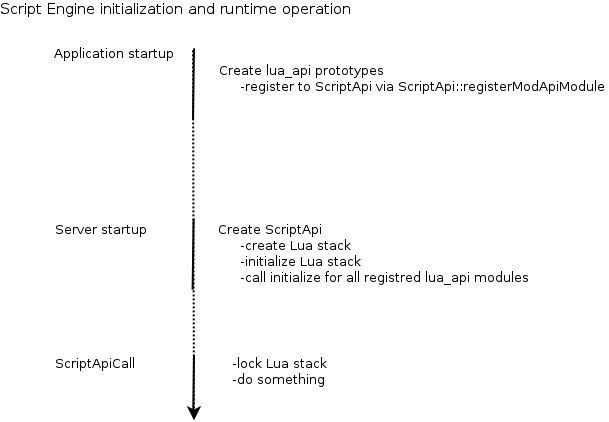
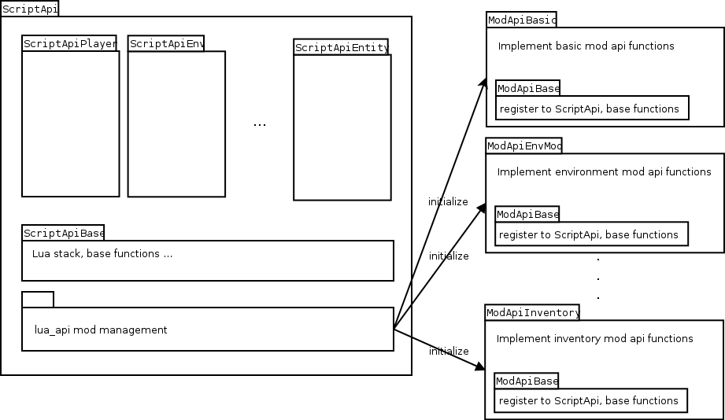

## Conventions

-   Script Engine uses a modular design separating code with different purpose as much as possible.
-   As minetest uses a flat includefile namespace any filename has to be unique. As result files are prefixed within script engine.

## Initialization

There are basicaly two initialization phases, on creation of application prototypes register lua_api modules to ScriptApi. Once server is started a new ScriptApi instance is created wich initializes a new Lua stack using all initialization functions provided by lua_api.

Note about the image: Its partially outdated. Since commit 4e1f50035e860a00636ca5d804c267119df99601, the registerModApiModule function has been removed.

## Common

Prefix: c\_

Within common subfolder parts of script api are implemented that need to be available for cpp as well as lua implementation. Examples for this are converter functions translating core c++ structs to lua or back from lua to c++. Another set of common functions are debugging and error handling function.

## cpp_api

Prefix: s\_

cpp_api provides interface required by c++ core functions. It\'s designed to be added as single class ScriptApi. This class inherits features from all submodules within cpp. ScriptApi is responsible for mod api management too. Any function required by all modules are implemented in ScriptApiBase, thus each modul inherits this class. To avoid inheritance problems each module has to be derived \"virtual\". The class design is layered as follows:

## lua_api

Prefix: l\_

lua_api contains implementation of all functions that are available from within lua. It\'s design is similar to cpp_api with difference that there is no integrating top class equivalent to ScriptApi. Instead of linking everything together each module is registred to ScriptApi by creating a prototype. Creating this prototype ensures ScriptApi will add the functions provided by this module by calling initialize from prototype. Modules are separated by functionality e.g. particles, inventory, environment, craft \... Modules are independent from each other.

[Category:Core Engine](Category:Core_Engine "wikilink")
