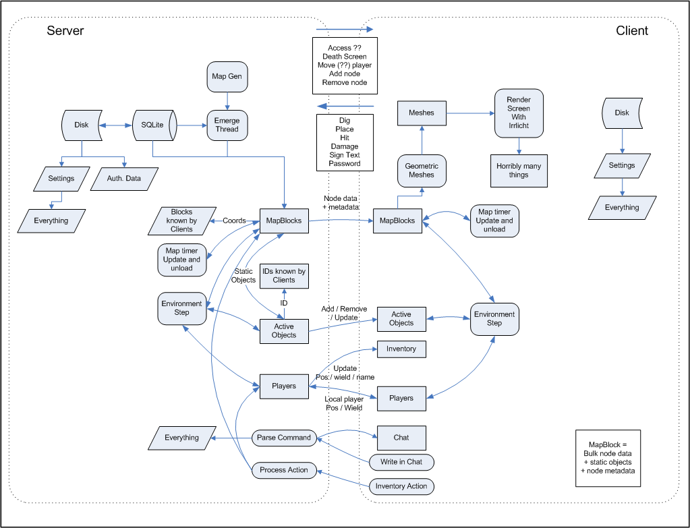

{width="500"}

## General architecture {#general_architecture}

Minetest consists of 3 main \"components\":

-   Server - runs server-side logic, updating things for connected players.
-   Client - graphics, controls, and logic for a single player.
-   Mainmenu - The main menu, before joining a game.

Each of these \"components\" consists of some C++ code and a Lua API for scripting.

When playing a game, there must always be a server. A singleplayer game will consist of a client and a server running in the same process but on different threads. A multiple remote game will consist of a client running locally, and a server running remotely.

### Environment

Both the server and the client have an Environment. An environment contains the map, any nodes, players, [objects](Engine/Objects "wikilink"), and various other things. The environment is \"stepped\" by an interval called a dtime, updating the world and running Lua callbacks.

The map is a container of MapBlocks. A MapBlock contains 16x16x16 nodes, any [static objects](Engine/Objects "wikilink"), and meta data.

### Server

The Server class is the main class for the server. It hosts the update loop, and owns the lifecycle of all other server components. Whilst there will always need to be a main class to host the update loop, this class may be considered a god class as it contains a lot of other responsibility.

In singleplayer or local server mode, the server class is started on a thread

### Client / MainMenu {#client_mainmenu}

The ClientLauncher is used to initialise the window, contains the main menu loop, and is used to determine how the client should be launched.

The Game class is the main class for the client. It hosts the clear-draw-display-update loop, and owns the lifecycle of all other client components.

## Threads

### Stand-alone server {#stand_alone_server}

-   main

:\* Doesn\'t do much

-   ServerThread (Server)

:\* Runs the server

-   EmergeThread (Server)

:\* Fetches and generates world

### Client-only {#client_only}

-   main

:\* Runs almost everything in main game loop

-   MeshUpdateThread (Client)

:\* Does mesh updates in the background

### Singleplayer

-   main

:\* Runs almost everything except server in main game loop

-   MeshUpdateThread (Client)

:\* Does mesh updates in the background

-   ServerThread (Server)

:\* Runs the server

-   EmergeThread (Server)

:\* Fetches and generates world

## Classes

### IGameDef

An interface for fetching pointers to the managers of things. It is passed to almost everything.

It is implemented by Client and Server. Neither implements all interfaces.

Generally these can be accessed by referring to IGameDef:

-   TextureSource
-   ItemDefManager
-   NodeDefManager
-   SoundManager
-   MtEventManager

This is the main difference between 0.3 and 0.4. In 0.3 this does not exist, because all content is defined in static tables in source code.

gamedef.{h,cpp}

### TextureSource

Fetches, generates and caches textures.

tile.{h,cpp}

### ItemDefManager

Stores the definitions of items, by item name. Content is set up at server startup, and transferred from server to client at beginning of connection.

itemdef.{h,cpp}

### NodeDefManager

Stores the definitions of nodes and the mapping between node ids and names. Content is set up at server startup, and transferred from server to client at beginning of connection.

nodedef.{h,cpp}

### SoundManager

Stores and plays sounds on the client.

sound.{h,cpp}; sound_openal.{h,cpp}

### MtEventManager

A minimal event manager currently only used for triggering sounds on the client.

event.{h,cpp}

### Client

Contains a lot of stuff. Most considerable members are listed here.

-   TextureSource
-   ItemDefManager
-   NodeDefManager
-   SoundManager
-   MtEventManager
-   MeshUpdateThread
-   ClientEnvironment

:\* ClientMap

:\* Players

:\* ClientActiveObjects (CAOs)

-   Connection

Implements IGameDef.

client.{h,cpp}

### Server {#server_1}

Contains a lot of stuff. Most considerable members are listed here.

-   ServerEnvironment

:\* ServerMap

:\* Players

:\* ServerActiveObjects (SAOs)

-   Connection
-   BanManager
-   Lua State
-   ItemDefManager
-   NodeDefManager
-   CraftDefManager
-   ServerThread
-   EmergeThread

Implements IGameDef.

server.{h,cpp}

### [Script Engine](Script_Engine "wikilink") {#script_engine}

script/\*

The script engine contains \"core to script\"- as well as \"script to core\"-interface implementation.

### Connection

Connection (client-\>server or server-\>clients)

### ClientEnvironment (Environment) {#clientenvironment_environment}

Contains most of the actual game environment (players, objects, map\...)

-   ClientMap
-   Players
-   ClientActiveObjects (CAOs)

environment.{h,cpp}

### ServerEnvironment (Environment) {#serverenvironment_environment}

Contains the actual game environment (players, objects, map, time of day, \...)

-   ServerMap
-   Players
-   ServerActiveObjects (SAOs)

environment.{h,cpp}

### ClientMap (Map) {#clientmap_map}

map.{h,cpp}, clientmap.{h,cpp}

### ServerMap (Map) {#servermap_map}

map.{h,cpp}

[Category:Core Engine](Category:Core_Engine "wikilink")
