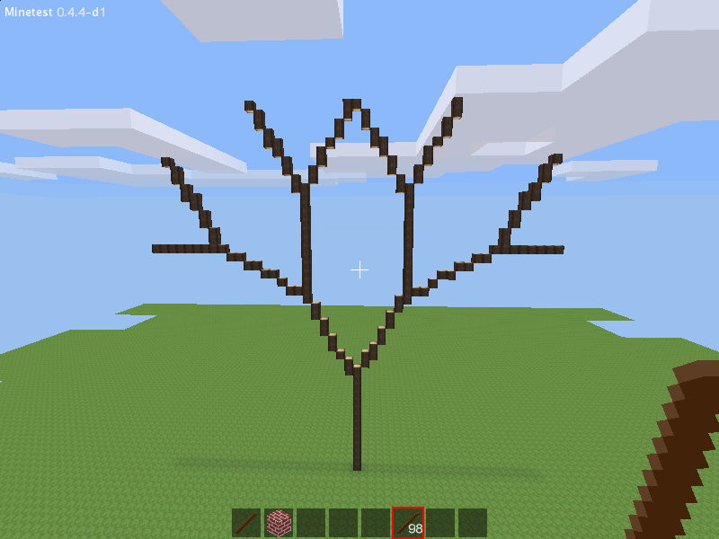

Minetest has two types of trees built in: Small simple ones like the trees in the vanilla Minetest game, and more complex ones generated using a L-system and a tree definition. L-system trees can be spawned with `minetest.spawn_tree` and are defined by a `treedef` table.

The following chat log might be helpful in understanding how L-system trees work: [#minetest 2013-08-08](http://irc.minetest.ru/minetest/2013-08-08#i_3250058)

## Turtle graphics {#turtle_graphics}

The [L-system](https://en.wikipedia.org/wiki/L-system) is much like turtle graphics: there is a cursor, it is called the turtle. It can be moved and rotated, and place none, one or more nodes in each step, depending on the used command:

  Symbol   Action
  -------- ----------------------------------------------------------------------
  G        Move forward one unit with the pen up
  F        Move forward one unit with the pen down drawing trunks and branches
  f        Move forward one unit with the pen down drawing leaves (100% chance)
  T        Move forward one unit with the pen down drawing trunks only
  R        Move forward one unit with the pen down placing fruit

  Symbol   Action
  -------- -------------------------------------------------
  \+       Yaw the turtle right by angle parameter
  \-       Yaw the turtle left by angle parameter
  &        Pitch the turtle down by angle parameter
  \^       Pitch the turtle up by angle parameter
  /        Roll the turtle to the right by angle parameter
  \*       Roll the turtle to the left by angle parameter

The turtle always starts facing up.

## Axiom

If the axiom is `TTTT` the result is four vertically stacked nodes of trunk material. The turtle starts at its spawn position, and does the step T four times. T means "move forward one unit with the pen down drawing trunks only". Because the turtle is initially facing up, the resulting structure is vertical.

With the axiom `TTTTT&TTTTT&TTTTT&TTTTT` and the angle set to 90 degrees the result is a square of trunk material. After this program the turtle will be back on its spawn position, lying on its side, facing left.

## Stack

  Symbol   Action
  -------- --------------------------------------
  \[       Push/save current state into stack
  \]       Pop/recover current state from stack

With these commands it is possible to save and recover both position and direction of the turtle. The axiom `TTTTT[^TTTTT][&TTTTT]` with the angle set to 60 degrees makes a "Y" shape. As always the turtle starts at spawn position, facing up. It goes forwards (up!) 5 times, placing trunks. Then the position and rotation are saved. The part wrapped in `[` and `]` is done, and the turtle is back to the position we saved before. Now the 2nd branch is done, starting from the same pos as the first.

## Lindenmayer basics {#lindenmayer_basics}

### Replacing

A L-system "program" consists of the axiom and replacement rules. In addition to above, turtle knows the symbols A, B, C and D, which can be used in L-systems. Everytime one of those symbols is found in the axiom, it will be replaced with the whole corresponding rule. This will be done, until there are no more replacements to do or the maximum recursion depth is reached.

  Symbol   Action
  -------- -------------------------
  A        Replace with rule set A
  B        Replace with rule set B
  C        Replace with rule set C
  D        Replace with rule set D

#### Example

Let\'s say we want to create a fractal "Y" shape: It looks like a "Y" but both ends of it are themselves shaped like "Y"s. With 3 recursions this should give us a total of 8 (2^3^) ends.

Here is the axiom:

`TTTTTA`

Now rule A needs to create the branch. If rule A itself uses an A at its end, that will be replaced again, and so on ... Rule A is this:

`[^TTTTTA][&TTTTTA]`

Let\'s look at it step by step: First we do the axiom, just a vertical trunk. Then on its top is added one V shape (rule A). All in all the tree now looks like this: `TTTTT[^TTTTTA][&TTTTTA]` (the first A has been replaced by the whole of rule A). In the next step both A\'s at the end of the branches are replaced, again with the whole of rule A, giving this:

`TTTTT[^TTTTT[^TTTTTA][&TTTTTA]][&TTTTT[^TTTTTA][&TTTTTA]]`

And after the 3rd recursion this is the result:

### Replacing by chance {#replacing_by_chance}

The symbols a, b, c, d work like the symbols A, B, C, and D, respectively, but they will only be replaced by chance.

  Symbol   Action
  -------- -----------------------------------------------------------------
  a        Replace with rule set A with a 90% chance, do nothing otherwise
  b        Replace with rule set B with a 80% chance, do nothing otherwise
  c        Replace with rule set C with a 70% chance, do nothing otherwise
  d        Replace with rule set D with a 60% chance, do nothing otherwise

### See also {#see_also}

-   [L-system tree examples](L-system_tree_examples "wikilink")
-   [L-System Tree Utility](https://forum.minetest.net/viewtopic.php?f=11&t=9458) (a mod which helps to create L-system trees in-game)

[Category:Modding API](Category:Modding_API "wikilink")
