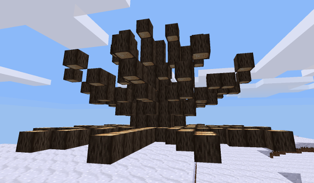
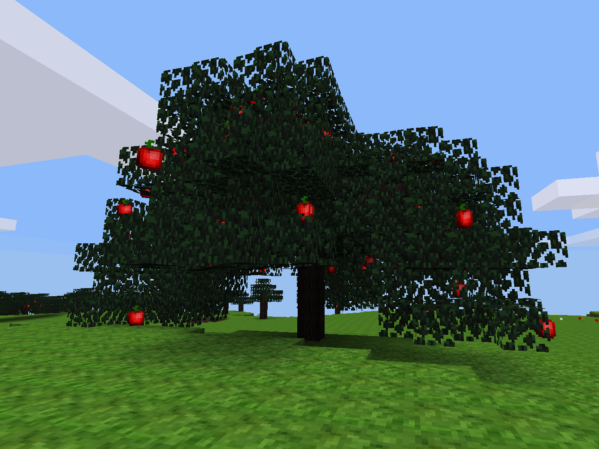

This wiki page is a collection of example [L-system trees](Introduction_to_L-system_trees "wikilink"). The intention is to help newbies better understand L-system trees, but also to provide usable tree definitions which could be used in mods.

## Giant dry shrub {#giant_dry_shrub}

### Profile

Works in any game with basic map generation.

### Definition

    treedef={
       axiom = "A/A/A/A/A/A/A/A/A/A/A/A",
       rules_a = "[B+B+B+B]",
       rules_b = "[FFFFFFFFFF]",
       trunk = "mapgen_tree",
       angle = 30,
       iterations = 1,
       random_level = 0,
       trunk_type = "single",
       thin_branches = true
    }

### Screenshot

{width="420"}

## Apple tree {#apple_tree}

### Profile {#profile_1}

Works in any game with basic map generation. This tree is used as the example tree in the mod "[L-System Tree Utility](https://forum.minetest.net/viewtopic.php?f=11&t=9458)".

### Definition {#definition_1}

    treedef = {
        axiom="FFFFFAFFBF",
        rules_a="[&&&FFFFF&&FFFF][&&&++++FFFFF&&FFFF][&&&----FFFFF&&FFFF]",
        rules_b="[&&&++FFFFF&&FFFF][&&&--FFFFF&&FFFF][&&&------FFFFF&&FFFF]",
        trunk="mapgen_tree",
        leaves="mapgen_leaves",
        angle=30,
        iterations=2,
        random_level=0,
        trunk_type="single",
        thin_branches=true,
        fruit_chance=10,
        fruit="mapgen_apple",
    }

### Screenshot {#screenshot_1}

{width="420"}

## Acacia

### Profile {#profile_2}

-   **Game used**: Minetest Game
-   **Additional mods**: *None*

### Definition {#definition_2}

    treedef={
       axiom="FFFFFFccccA",
       rules_a = "[B]//[B]//[B]//[B]",
       rules_b = "&TTTT&TT^^G&&----GGGGGG++GGG++"   -- line up with the "canvas" edge
             .."fffffffGG++G++"               -- first layer, drawn in a zig-zag raster pattern
             .."Gffffffff--G--"
             .."ffffffffG++G++"
             .."fffffffff--G--"
             .."fffffffff++G++"
             .."fffffffff--G--"
             .."ffffffffG++G++"
             .."Gffffffff--G--"
             .."fffffffGG"
             .."^^G&&----GGGGGGG++GGGGGG++"      -- re-align to second layer canvas edge
             .."ffffGGG++G++"               -- second layer
             .."GGfffff--G--"
             .."ffffffG++G++"
             .."fffffff--G--"
             .."ffffffG++G++"
             .."GGfffff--G--"
             .."ffffGGG",
       rules_c = "/",
       trunk="default:acacia_tree",
       leaves="default:acacia_leaves",
       angle=45,
       iterations=3,
       random_level=0,
       trunk_type="single",
       thin_branches=true,
    }

[Category:Modding API](Category:Modding_API "wikilink")
