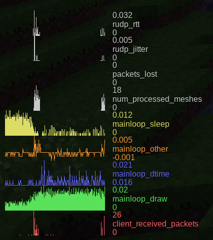

```{=mediawiki}
{{Incomplete}}
```
The profiler graphs show the performance of Minetest in a more detailed fashion. This information is useful for engine developers. The profiler graphs are shown when you hit the debug key (`<kbd>`{=html}F5`</kbd>`{=html} by default) twice.



The following graphs are available:

-   **rudp_rtt**: ???
-   **rudp_jitter**: ???
-   **packets_lost**: ???
-   **num_processed_meshes**: The engine generates geometric meshes from MapBlock data for drawing. This is the number of those meshes that finished generating in each frame.
-   **mainloop_sleep**: If the game runs at a faster rate than `wanted_fps`, a sleep is inserted into each frame after drawing in order to not consume excess resources; this is that sleep time in seconds.
-   **mainloop_other**: Time (in seconds) spent in each frame for everything else than drawing.
-   **mainloop_dtime**: Total time (in seconds) spent per frame (`mainloop_other + mainloop_draw + mainloop_sleep`); FPS = 1 divided by this, averaged.
-   **mainloop_draw**: Time (in seconds) spent in each frame for drawing (rendering).
-   **client_received_packets**: Number of received high-level protocol packets in each frame.

## See also {#see_also}

-   [Debug](https://wiki.minetest.net/Debug)

[Category:Debugging](Category:Debugging "wikilink") [Category:Core Engine](Category:Core_Engine "wikilink")
